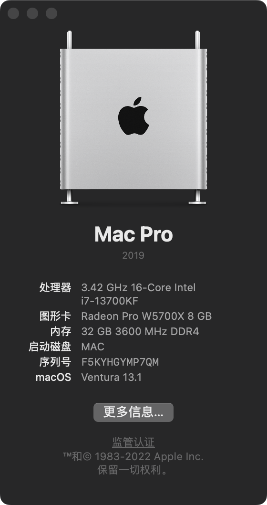
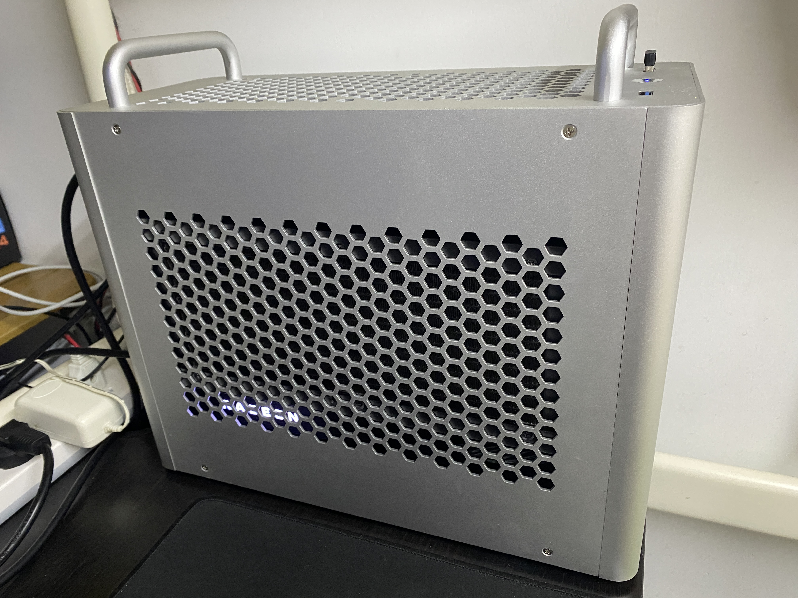
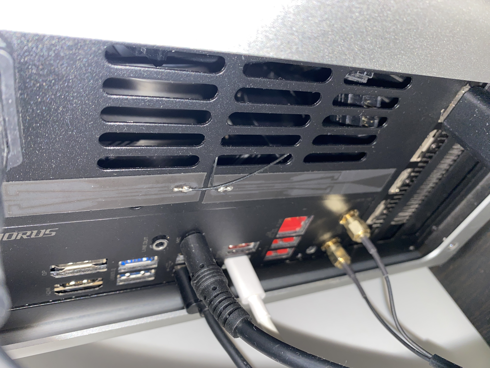
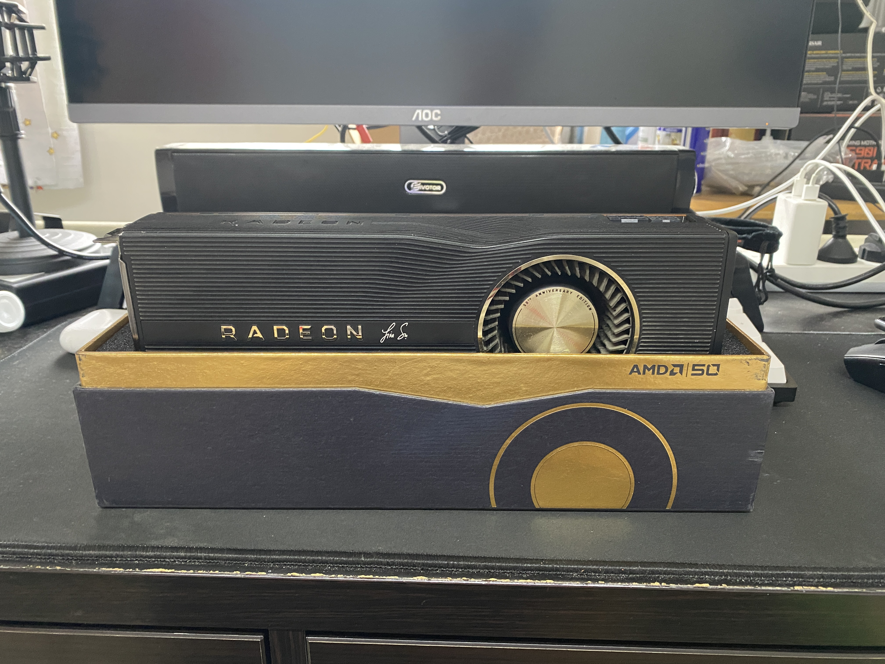

# Hackintosh-GIGABYTE-Z690I-UL-DDR4

This repository is about hackintosh on **GIGABYTE Z690I AORUS ULTRA LITE DDR4**. All the hardware is working as expected, and it's ready for daily usage. 

Highly recommended reading the whole [OpenCore Install Guide](https://dortania.github.io/OpenCore-Install-Guide/) before start.

这是一个**技嘉 Z690I AORUS ULTRA LITE DDR4**主板的黑苹果仓库，所有的硬件都正确工作，日常使用无问题

在开始之前强烈建议完整阅读[OpenCore Install Guide](https://dortania.github.io/OpenCore-Install-Guide/) 

## 主板介绍

[Z690I AORUS ULTRA LITE DDR4 (rev. 1.0)](https://www.gigabyte.com/Motherboard/Z690I-AORUS-ULTRA-LITE-DDR4-rev-10)

## 硬件列表

| 项目     | 型号                                          |
| -------- | --------------------------------------------- |
| 主板     | GIGABYTE 技嘉 Z690I AORUS Ultra LITE DDR4     |
| CPU      | Intel® Core™ i7-13700KF                       |
| 内存     | 金百达 银爵 32GB(16G×2) DDR4 3600             |
| 硬盘     | 西数 WD_BLACK™ SN750 500G                     |
| 显卡     | AMD Radeon RX 5700 XT 50 周年纪念版           |
| 电源     | 海盗船 SF750 Platinum                         |
| 无线网卡 | 博通 BCM94352Z(fenvi) + m.2转ngff卡 + FPC天线 |
| 有线网卡 | Intel I225-V 2.5Gbit                          |
| 板载声卡 | Realtek® ALC4080 CODEC                        |
| 散热     | 瓦尔基里(VALKYRIE）C240-RGB                   |
| 机箱     | 逾辉 铝途 1                                   |

> 由于插槽使用cnvi协议，主板上的板载ax201**无法直接更换**为博通网卡

## 软件

* Bootloader: OpenCore 0.8.8-RELEASE
* OS: macOS Ventura 13.1 (MacPro7,1)

## 实现功能

- [x] CPU变频/大小核调度
- [x] AMD Radeon Pro W5700X 仿冒
- [x] Audio Realtek® ALC4080 CODEC
- [x] Intel I225-V 2.5Gb Ethernet
- [x] Wi-Fi/蓝牙 (BCM94352Z)
- [x] AirDrop
- [x] USB定制
- [x] 睡眠/唤醒
- [x] 原生电源管理

### BIOS

> Version: F22

- CFG-Lock - off
- Fast Boot - off
- VT-d - off
- CSM - off
- VT-x - on
- Above 4G decoding - on
- Re-Size BAR Support - off
- XHCI Hand-off - on

## 工具

* 编译 SSDT: [MaciASL](https://github.com/acidanthera/MaciASL)
* 编辑 plist: [OpenCore Auxiliary Tools (OCAT)](https://github.com/ic005k/OCAuxiliaryTools)
* 编辑 plist: [PropereTree](https://github.com/corpnewt/ProperTree)
* Dumping DSDT: [SSDTTime](https://github.com/corpnewt/SSDTTime)
* Toolbox: [Hackintool](https://github.com/headkaze/Hackintool)

## Benchmarks

| 项目                                            | 分数                          |
| ----------------------------------------------- | ----------------------------- |
| CPU - Geekbench                                 | 单核: 2180 / 多核: 17980      |
| CPU - Cinebench R23                             | 单核: 2135 / 多核: 30154      |
| AMD Radeon RX 5700 XT 50 周年纪念版 - Geekbench | OpenCL: 70184: / Metal: 79835 |

## 展示

|      |  |
| ---------------------------------- | ---------------------------------- |
|  |  |

## 参考

[Dortania's OpenCore Install Guide](https://dortania.github.io/OpenCore-Install-Guide/)

[OpenCore bootloader](https://github.com/acidanthera/OpenCorePkg)

[OpenCore 简体中文参考手册](https://oc.skk.moe/)

[国光的黑苹果安装教程：手把手教你配置 OpenCore](https://apple.sqlsec.com/)
